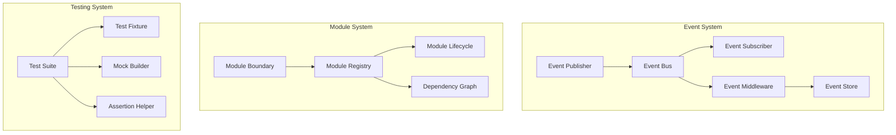

# Design Document: Framework Enhancements

## Overview

本设计文档描述了 Eogo 框架三个核心增强模块的技术架构：事件系统、模块化组织和测试工具。这些模块遵循 Go 语言最佳实践，与现有框架架构无缝集成。

### Design Goals

1. **可观测性**: 通过事件系统提供业务流程的完整可见性
2. **模块化**: 通过清晰的边界和依赖管理提升代码组织
3. **可测试性**: 通过丰富的测试工具提升开发体验

## Architecture

### High-Level Architecture



### Package Structure

```
internal/
├── infra/
│   ├── events/           # Event System
│   │   ├── bus.go        # Event bus implementation
│   │   ├── middleware.go # Event middleware
│   │   ├── store.go      # Event persistence
│   │   └── types.go      # Event types and interfaces
│   │
│   ├── module/           # Module System
│   │   ├── registry.go   # Module registry
│   │   ├── lifecycle.go  # Lifecycle management
│   │   ├── dependency.go # Dependency resolution
│   │   └── boundary.go   # Module boundary
│   │
│   └── testing/          # Testing Utilities (enhanced)
│       ├── suite.go      # Test suite builder
│       ├── fixture.go    # Test fixtures
│       ├── mock.go       # Mock builder
│       ├── assert.go     # Assertion helpers
│       └── events.go     # Event testing
```

## Components and Interfaces

### 1. Event System

#### Event Interface

```go
// Event represents a domain event
type Event interface {
    // EventName returns the unique event identifier (e.g., "user.created")
    EventName() string
    // OccurredAt returns when the event occurred
    OccurredAt() time.Time
    // Metadata returns event metadata
    Metadata() EventMetadata
}

// EventMetadata contains event metadata
type EventMetadata struct {
    ID            string    // Unique event ID
    CorrelationID string    // For tracing related events
    CausationID   string    // ID of the event that caused this one
    Timestamp     time.Time // When the event was created
    Source        string    // Source module/service
}
```

#### Event Bus Interface

```go
// EventBus handles event publishing and subscription
type EventBus interface {
    // Publish sends an event to all subscribers
    Publish(ctx context.Context, event Event) error
    
    // PublishAsync sends an event asynchronously
    PublishAsync(ctx context.Context, event Event)
    
    // Subscribe registers a handler for an event type
    Subscribe(eventName string, handler EventHandler, opts ...SubscribeOption) Subscription
    
    // Unsubscribe removes a subscription
    Unsubscribe(sub Subscription)
    
    // Use adds middleware to the event bus
    Use(middleware ...EventMiddleware)
}

// EventHandler processes events
type EventHandler func(ctx context.Context, event Event) error

// Subscription represents an active subscription
type Subscription interface {
    Unsubscribe()
    EventName() string
}

// SubscribeOption configures subscription behavior
type SubscribeOption func(*subscribeOptions)

func WithPriority(priority int) SubscribeOption
func WithAsync() SubscribeOption
func WithRetry(maxRetries int, backoff time.Duration) SubscribeOption
```

#### Event Middleware

```go
// EventMiddleware wraps event handling
type EventMiddleware func(next EventHandler) EventHandler

// Built-in middleware
func LoggingMiddleware(logger Logger) EventMiddleware
func TracingMiddleware(tracer trace.Tracer) EventMiddleware
func RecoveryMiddleware(onPanic func(error)) EventMiddleware
func RetryMiddleware(maxRetries int, backoff time.Duration) EventMiddleware
```

#### Event Store Interface

```go
// EventStore persists events for audit and replay
type EventStore interface {
    // Store persists an event
    Store(ctx context.Context, event Event) error
    
    // Query retrieves events matching criteria
    Query(ctx context.Context, query EventQuery) ([]StoredEvent, error)
    
    // Replay replays events to a handler
    Replay(ctx context.Context, query EventQuery, handler EventHandler) error
}

// EventQuery defines event query criteria
type EventQuery struct {
    EventNames    []string
    CorrelationID string
    From          time.Time
    To            time.Time
    Limit         int
    Offset        int
}
```

### 2. Module System

#### Module Interface

```go
// Module represents a framework module
type Module interface {
    // Name returns the unique module name
    Name() string
    
    // DependsOn returns module dependencies
    DependsOn() []string
}

// LifecycleModule extends Module with lifecycle hooks
type LifecycleModule interface {
    Module
    
    // OnInit is called during module initialization
    OnInit(ctx context.Context) error
    
    // OnStart is called after all modules are initialized
    OnStart(ctx context.Context) error
    
    // OnStop is called during graceful shutdown
    OnStop(ctx context.Context) error
}

// ServiceProvider exposes services to other modules
type ServiceProvider interface {
    Module
    
    // Services returns services to register with DI
    Services() []interface{}
}
```

#### Module Registry

```go
// Registry manages module registration and lifecycle
type Registry interface {
    // Register adds a module to the registry
    Register(module Module) error
    
    // Get retrieves a module by name
    Get(name string) (Module, bool)
    
    // All returns all registered modules
    All() []Module
    
    // Query finds modules matching criteria
    Query(opts ...QueryOption) []Module
    
    // Init initializes all modules in dependency order
    Init(ctx context.Context) error
    
    // Start starts all modules
    Start(ctx context.Context) error
    
    // Stop stops all modules in reverse order
    Stop(ctx context.Context) error
}

// QueryOption filters modules
type QueryOption func(*queryOptions)

func WithTag(tag string) QueryOption
func WithDependency(dep string) QueryOption
```

#### Dependency Graph

```go
// DependencyGraph manages module dependencies
type DependencyGraph interface {
    // Add adds a module with its dependencies
    Add(name string, deps []string) error
    
    // TopologicalSort returns modules in initialization order
    TopologicalSort() ([]string, error)
    
    // HasCycle checks for circular dependencies
    HasCycle() bool
    
    // Dependencies returns all dependencies (direct + transitive)
    Dependencies(name string) []string
}
```

### 3. Testing Utilities

#### Test Suite Builder

```go
// Suite provides a fluent API for test organization
type Suite struct {
    t *testing.T
}

func NewSuite(t *testing.T) *Suite

// Describe groups related tests
func (s *Suite) Describe(name string, fn func(s *Suite)) *Suite

// It defines a test case
func (s *Suite) It(name string, fn func(t *testing.T)) *Suite

// BeforeEach runs before each test
func (s *Suite) BeforeEach(fn func(t *testing.T)) *Suite

// AfterEach runs after each test
func (s *Suite) AfterEach(fn func(t *testing.T)) *Suite

// BeforeAll runs once before all tests
func (s *Suite) BeforeAll(fn func(t *testing.T)) *Suite

// AfterAll runs once after all tests
func (s *Suite) AfterAll(fn func(t *testing.T)) *Suite

// Skip marks tests to skip
func (s *Suite) Skip(reason string) *Suite

// Focus runs only focused tests
func (s *Suite) Focus() *Suite

// TestCases creates table-driven tests
func (s *Suite) TestCases(name string, cases []TestCase, fn func(t *testing.T, tc TestCase)) *Suite
```

#### Test Fixture

```go
// Fixture provides test environment setup
type Fixture struct {
    t       *testing.T
    db      *gorm.DB
    router  *gin.Engine
    cleanup []func()
}

func NewFixture(t *testing.T, opts ...FixtureOption) *Fixture

// DB returns an isolated database connection
func (f *Fixture) DB() *gorm.DB

// Router returns a configured test router
func (f *Fixture) Router() *gin.Engine

// Seed seeds test data
func (f *Fixture) Seed(seeders ...Seeder) *Fixture

// Cleanup registers cleanup functions
func (f *Fixture) Cleanup(fn func()) *Fixture

// Close cleans up all resources
func (f *Fixture) Close()

// FixtureOption configures the fixture
type FixtureOption func(*fixtureOptions)

func WithDatabase() FixtureOption
func WithRouter(handlers *app.Handlers) FixtureOption
func WithMigrations() FixtureOption
```

#### Mock Builder

```go
// Mock provides a fluent mock builder
type Mock[T any] struct {
    calls []mockCall
}

func NewMock[T any]() *Mock[T]

// On sets up a method expectation
func (m *Mock[T]) On(method string) *Expectation

// Expectation configures method behavior
type Expectation struct{}

// WithArgs matches specific arguments
func (e *Expectation) WithArgs(args ...interface{}) *Expectation

// Returns sets the return values
func (e *Expectation) Returns(values ...interface{}) *Expectation

// Times expects the method to be called n times
func (e *Expectation) Times(n int) *Expectation

// Once expects exactly one call
func (e *Expectation) Once() *Expectation

// Never expects no calls
func (e *Expectation) Never() *Expectation

// Capture captures arguments for inspection
func (e *Expectation) Capture(ptr interface{}) *Expectation

// Build returns the mock instance
func (m *Mock[T]) Build() T

// Verify checks all expectations were met
func (m *Mock[T]) Verify(t *testing.T)
```

#### Assertion Helpers

```go
// Assert provides rich assertions
type Assert struct {
    t *testing.T
}

func NewAssert(t *testing.T) *Assert

// JSON assertions
func (a *Assert) JSONPath(json []byte, path string) *JSONAssertion
func (a *Assert) JSONEquals(actual, expected interface{}) *Assert

// Database assertions
func (a *Assert) DatabaseHas(table string, conditions map[string]interface{}) *Assert
func (a *Assert) DatabaseMissing(table string, conditions map[string]interface{}) *Assert
func (a *Assert) DatabaseCount(table string, expected int) *Assert

// Event assertions
func (a *Assert) EventPublished(eventName string) *EventAssertion
func (a *Assert) EventNotPublished(eventName string) *Assert
func (a *Assert) EventsInOrder(eventNames ...string) *Assert

// Time assertions
func (a *Assert) TimeEquals(actual, expected time.Time, tolerance time.Duration) *Assert
func (a *Assert) TimeAfter(actual, expected time.Time) *Assert
func (a *Assert) TimeBefore(actual, expected time.Time) *Assert

// Diff on failure
func (a *Assert) Equal(expected, actual interface{}) *Assert
```

#### Event Testing

```go
// EventRecorder captures events for testing
type EventRecorder struct {
    events []Event
    mu     sync.Mutex
}

func NewEventRecorder() *EventRecorder

// Record captures an event
func (r *EventRecorder) Record(event Event)

// Events returns all recorded events
func (r *EventRecorder) Events() []Event

// EventsNamed returns events with the given name
func (r *EventRecorder) EventsNamed(name string) []Event

// Clear clears recorded events
func (r *EventRecorder) Clear()

// Assert returns an assertion helper for events
func (r *EventRecorder) Assert(t *testing.T) *EventAssertion

// EventAssertion provides event-specific assertions
type EventAssertion struct {
    t        *testing.T
    recorder *EventRecorder
    event    Event
}

func (ea *EventAssertion) WasPublished() *EventAssertion
func (ea *EventAssertion) WasPublishedTimes(n int) *EventAssertion
func (ea *EventAssertion) WithPayload(expected interface{}) *EventAssertion
func (ea *EventAssertion) Before(other string) *EventAssertion
func (ea *EventAssertion) After(other string) *EventAssertion
```

## Data Models

### Event Storage Model

```go
// StoredEvent represents a persisted event
type StoredEvent struct {
    ID            uint      `gorm:"primaryKey"`
    EventID       string    `gorm:"uniqueIndex;size:36"`
    EventName     string    `gorm:"index;size:255"`
    CorrelationID string    `gorm:"index;size:36"`
    CausationID   string    `gorm:"size:36"`
    Payload       []byte    `gorm:"type:text"`
    Metadata      []byte    `gorm:"type:text"`
    OccurredAt    time.Time `gorm:"index"`
    CreatedAt     time.Time
}
```

### Module Metadata Model

```go
// ModuleInfo contains module metadata
type ModuleInfo struct {
    Name         string
    Version      string
    Description  string
    Dependencies []string
    Tags         []string
    Services     []ServiceInfo
}

// ServiceInfo describes an exposed service
type ServiceInfo struct {
    Name      string
    Interface reflect.Type
    Impl      reflect.Type
}
```


## Correctness Properties

*A property is a characteristic or behavior that should hold true across all valid executions of a system—essentially, a formal statement about what the system should do. Properties serve as the bridge between human-readable specifications and machine-verifiable correctness guarantees.*

### Event System Properties

**Property 1: Event Delivery Completeness**

*For any* event published to the event bus and *for any* set of handlers subscribed to that event type, all handlers SHALL be invoked with the event, and handlers registered earlier SHALL be invoked before handlers registered later (unless priority is specified).

**Validates: Requirements 1.1, 2.1, 2.2**

---

**Property 2: Event Metadata Presence**

*For any* event published through the event bus, the event SHALL contain non-empty metadata including: a unique event_id, a timestamp equal to or after the event's OccurredAt time, and a source identifier.

**Validates: Requirements 1.2**

---

**Property 3: Synchronous Error Propagation**

*For any* event handler that returns an error during synchronous dispatch, the Publish() method SHALL return that error to the caller.

**Validates: Requirements 1.4**

---

**Property 4: Priority-Based Handler Ordering**

*For any* set of handlers subscribed to the same event with different priorities, handlers with higher priority values SHALL be invoked before handlers with lower priority values.

**Validates: Requirements 2.3**

---

**Property 5: Wildcard Pattern Matching**

*For any* wildcard subscription pattern (e.g., "user.*") and *for any* event name, the handler SHALL be invoked if and only if the event name matches the pattern according to glob-style matching rules.

**Validates: Requirements 2.4**

---

**Property 6: Unsubscription Effectiveness**

*For any* handler that has been unsubscribed from an event type, subsequent events of that type SHALL NOT invoke the unsubscribed handler.

**Validates: Requirements 2.5**

---

**Property 7: Middleware Chain Ordering**

*For any* set of middleware registered with the event bus, middleware SHALL execute in registration order, and each middleware's next() call SHALL invoke the subsequent middleware or the final handler.

**Validates: Requirements 3.1, 3.5**

---

**Property 8: Retry Middleware Behavior**

*For any* handler wrapped with retry middleware configured for N retries, if the handler fails, it SHALL be retried up to N times before the error is propagated.

**Validates: Requirements 3.4**

---

**Property 9: Event Persistence Round-Trip**

*For any* event stored in the event store, querying by the event's ID, name, or correlation_id SHALL return the original event with identical payload and metadata.

**Validates: Requirements 4.1, 4.2**

---

**Property 10: Event Replay Chronological Order**

*For any* set of events replayed from the event store, events SHALL be delivered to the handler in chronological order based on their OccurredAt timestamp.

**Validates: Requirements 4.3**

---

### Module System Properties

**Property 11: Module Registration Uniqueness**

*For any* module registered with the registry, attempting to register another module with the same name SHALL return an error, and the original module SHALL remain registered.

**Validates: Requirements 5.1, 5.2**

---

**Property 12: Module Query Correctness**

*For any* query by name, tag, or dependency, the registry SHALL return exactly the modules that match the query criteria.

**Validates: Requirements 5.4**

---

**Property 13: Dependency-Ordered Initialization**

*For any* module with declared dependencies, the module's OnInit hook SHALL be called only after all its dependencies' OnInit hooks have completed successfully.

**Validates: Requirements 5.5, 7.1**

---

**Property 14: Lifecycle Hook Ordering**

*For any* module implementing lifecycle hooks: OnInit SHALL be called before OnStart, and OnStop SHALL be called in reverse initialization order during shutdown.

**Validates: Requirements 6.1, 6.2, 6.3**

---

**Property 15: Lifecycle Error Isolation**

*For any* module whose lifecycle hook returns an error, other modules' lifecycle hooks SHALL still be executed.

**Validates: Requirements 6.4**

---

**Property 16: Circular Dependency Detection**

*For any* set of modules where module A depends on B and B depends on A (directly or transitively), registration SHALL fail with a circular dependency error.

**Validates: Requirements 7.2**

---

**Property 17: Transitive Dependency Resolution**

*For any* module, querying its dependencies SHALL return all direct dependencies plus all transitive dependencies (dependencies of dependencies).

**Validates: Requirements 7.4**

---

**Property 18: Service Registration**

*For any* module that exposes services via ServiceProvider interface, those services SHALL be available for injection after module initialization.

**Validates: Requirements 8.3**

---

### Testing Utilities Properties

**Property 19: Test Hook Execution Order**

*For any* test suite with BeforeEach, AfterEach, BeforeAll, and AfterAll hooks, BeforeAll SHALL run once before all tests, BeforeEach SHALL run before each test, AfterEach SHALL run after each test, and AfterAll SHALL run once after all tests.

**Validates: Requirements 9.2**

---

**Property 20: Fixture Cleanup**

*For any* test fixture, all registered cleanup functions SHALL be called when the fixture is closed, in reverse registration order.

**Validates: Requirements 10.3**

---

**Property 21: Test Data Isolation**

*For any* two test fixtures created in parallel, data created in one fixture SHALL NOT be visible in the other fixture.

**Validates: Requirements 10.5, 14.4**

---

**Property 22: Mock Return Values**

*For any* mock configured with Returns(values), calling the mocked method SHALL return the configured values.

**Validates: Requirements 11.2**

---

**Property 23: Mock Call Count Verification**

*For any* mock configured with Times(n), verification SHALL pass if and only if the method was called exactly n times.

**Validates: Requirements 11.3**

---

**Property 24: Mock Argument Matching**

*For any* mock configured with WithArgs(args), the mock SHALL only match calls where the arguments equal the configured args.

**Validates: Requirements 11.4**

---

**Property 25: Mock Argument Capture**

*For any* mock configured with Capture(ptr), after the mock is called, the captured pointer SHALL contain the actual argument value.

**Validates: Requirements 11.5**

---

**Property 26: JSON Path Assertion**

*For any* valid JSON document and valid JSON path, the assertion helper SHALL extract the correct value at that path.

**Validates: Requirements 12.1**

---

**Property 27: Database State Assertion**

*For any* database assertion with conditions, the assertion SHALL pass if and only if a record matching all conditions exists in the database.

**Validates: Requirements 12.2**

---

**Property 28: Time Assertion with Tolerance**

*For any* two times and a tolerance value, the time assertion SHALL pass if and only if the absolute difference between the times is less than or equal to the tolerance.

**Validates: Requirements 12.4**

---

**Property 29: Event Capture Completeness**

*For any* event published during a test with an event recorder active, the recorder SHALL capture the event with its complete payload.

**Validates: Requirements 13.1, 13.2, 13.3**

---

**Property 30: Event Order Assertion**

*For any* sequence of events published during a test, asserting event order SHALL pass if and only if the events were published in the asserted order.

**Validates: Requirements 13.4**

---

**Property 31: Transaction Rollback**

*For any* test using transaction rollback support, database changes made during the test SHALL NOT persist after the test completes.

**Validates: Requirements 14.5**

---

## Error Handling

### Event System Errors

| Error | Condition | Handling |
|-------|-----------|----------|
| `ErrEventBusClosed` | Publishing to a closed event bus | Return error immediately |
| `ErrHandlerPanic` | Handler panics during execution | Recover, log, optionally retry |
| `ErrContextCancelled` | Context cancelled during dispatch | Stop dispatch, return context error |
| `ErrStoreUnavailable` | Event store is unavailable | Log warning, continue without persistence |

### Module System Errors

| Error | Condition | Handling |
|-------|-----------|----------|
| `ErrDuplicateModule` | Module with same name already registered | Return error, reject registration |
| `ErrCircularDependency` | Circular dependency detected | Return error with cycle path |
| `ErrMissingDependency` | Required dependency not registered | Return error listing missing deps |
| `ErrInitTimeout` | Module init exceeds timeout | Cancel context, log error, continue |
| `ErrModuleNotFound` | Queried module doesn't exist | Return nil, false |

### Testing Errors

| Error | Condition | Handling |
|-------|-----------|----------|
| `ErrFixtureSetupFailed` | Fixture setup fails | Fail test immediately |
| `ErrMockVerificationFailed` | Mock expectations not met | Fail test with details |
| `ErrAssertionFailed` | Assertion fails | Fail test with diff |

## Testing Strategy

### Dual Testing Approach

This design requires both unit tests and property-based tests:

- **Unit tests**: Verify specific examples, edge cases, and error conditions
- **Property tests**: Verify universal properties across all inputs using randomized testing

### Property-Based Testing Configuration

- **Library**: [gopter](https://github.com/leanovate/gopter) for Go property-based testing
- **Minimum iterations**: 100 per property test
- **Tag format**: `// Feature: framework-enhancements, Property N: <property_text>`

### Test Organization

```
tests/
├── unit/
│   ├── events/
│   │   ├── bus_test.go
│   │   ├── middleware_test.go
│   │   └── store_test.go
│   ├── module/
│   │   ├── registry_test.go
│   │   ├── lifecycle_test.go
│   │   └── dependency_test.go
│   └── testing/
│       ├── suite_test.go
│       ├── fixture_test.go
│       ├── mock_test.go
│       └── assert_test.go
├── integration/
│   ├── events_integration_test.go
│   └── module_integration_test.go
└── property/
    ├── events_property_test.go
    ├── module_property_test.go
    └── testing_property_test.go
```

### Key Test Scenarios

#### Event System
- Event delivery to multiple handlers
- Middleware chain execution
- Error propagation and recovery
- Event persistence and replay
- Wildcard pattern matching

#### Module System
- Module registration and discovery
- Dependency graph resolution
- Circular dependency detection
- Lifecycle hook ordering
- Graceful shutdown

#### Testing Utilities
- Fixture setup and cleanup
- Mock configuration and verification
- Assertion accuracy
- Test isolation

