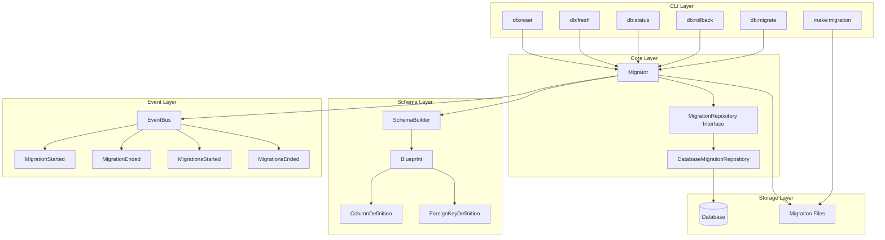

# Design Document: Migration System

## Overview

This document describes the technical design for refactoring Eogo's database migration system to follow Laravel's elegant design patterns. The system will be built using Go idioms while maintaining the conceptual elegance of Laravel's migration architecture.

The migration system consists of several interconnected components:
- **Migration Repository** - Abstraction for migration record storage
- **Migrator** - Core engine coordinating all migration operations
- **Schema Builder** - Fluent interface for table operations
- **Blueprint** - DSL for defining table structure
- **Migration Events** - Lifecycle events for monitoring
- **CLI Commands** - User-facing command-line tools

## Architecture



## Components and Interfaces

### Migration Repository Interface

```go
// internal/infra/migration/repository.go

package migration

// MigrationRecord represents a single migration record in the repository
type MigrationRecord struct {
    ID        uint
    Migration string
    Batch     int
}

// Repository defines the contract for migration record storage
type Repository interface {
    // GetRan returns all completed migration names ordered by batch and name
    GetRan() ([]string, error)
    
    // GetMigrations returns the last N migrations
    GetMigrations(steps int) ([]MigrationRecord, error)
    
    // GetMigrationsByBatch returns all migrations for a specific batch
    GetMigrationsByBatch(batch int) ([]MigrationRecord, error)
    
    // GetLast returns migrations from the last batch
    GetLast() ([]MigrationRecord, error)
    
    // GetMigrationBatches returns all migrations with their batch numbers
    GetMigrationBatches() (map[string]int, error)
    
    // Log records that a migration was run
    Log(migration string, batch int) error
    
    // Delete removes a migration record
    Delete(migration string) error
    
    // GetNextBatchNumber returns the next batch number
    GetNextBatchNumber() (int, error)
    
    // CreateRepository creates the migrations table
    CreateRepository() error
    
    // RepositoryExists checks if the migrations table exists
    RepositoryExists() bool
    
    // DeleteRepository drops the migrations table
    DeleteRepository() error
}
```

### Database Migration Repository

```go
// internal/infra/migration/database_repository.go

package migration

import (
    "gorm.io/gorm"
)

type databaseRepository struct {
    db        *gorm.DB
    tableName string
}

// NewDatabaseRepository creates a new database-backed migration repository
func NewDatabaseRepository(db *gorm.DB, tableName string) Repository {
    if tableName == "" {
        tableName = "migrations"
    }
    return &databaseRepository{
        db:        db,
        tableName: tableName,
    }
}

func (r *databaseRepository) GetRan() ([]string, error) {
    var migrations []string
    err := r.db.Table(r.tableName).
        Order("batch ASC, migration ASC").
        Pluck("migration", &migrations).Error
    return migrations, err
}

func (r *databaseRepository) GetLast() ([]MigrationRecord, error) {
    lastBatch, err := r.getLastBatchNumber()
    if err != nil {
        return nil, err
    }
    return r.GetMigrationsByBatch(lastBatch)
}

func (r *databaseRepository) GetNextBatchNumber() (int, error) {
    last, err := r.getLastBatchNumber()
    if err != nil {
        return 1, err
    }
    return last + 1, nil
}

func (r *databaseRepository) getLastBatchNumber() (int, error) {
    var max int
    err := r.db.Table(r.tableName).Select("COALESCE(MAX(batch), 0)").Scan(&max).Error
    return max, err
}

func (r *databaseRepository) CreateRepository() error {
    return r.db.Exec(`
        CREATE TABLE IF NOT EXISTS ` + r.tableName + ` (
            id INTEGER PRIMARY KEY AUTOINCREMENT,
            migration VARCHAR(255) NOT NULL,
            batch INTEGER NOT NULL
        )
    `).Error
}
```

### Migration Interface

```go
// internal/infra/migration/migration.go

package migration

import "gorm.io/gorm"

// Migration defines the contract for individual migration files
type Migration interface {
    // Up applies the migration
    Up(db *gorm.DB) error
    
    // Down reverts the migration
    Down(db *gorm.DB) error
    
    // GetConnection returns the database connection name (empty for default)
    GetConnection() string
    
    // WithinTransaction indicates if the migration should run in a transaction
    WithinTransaction() bool
}

// BaseMigration provides default implementations for Migration interface
type BaseMigration struct {
    Connection        string
    UseTransaction    bool
}

func (m *BaseMigration) GetConnection() string {
    return m.Connection
}

func (m *BaseMigration) WithinTransaction() bool {
    return m.UseTransaction
}
```

### Migrator Core Engine

```go
// internal/infra/migration/migrator.go

package migration

import (
    "fmt"
    "sort"
    
    "github.com/eogo-dev/eogo/internal/infra/events"
    "gorm.io/gorm"
)

// MigratorOptions configures the migrator behavior
type MigratorOptions struct {
    Pretend bool  // Show SQL without executing
    Step    bool  // Increment batch for each migration
    Force   bool  // Run in production
}

// Migrator coordinates all migration operations
type Migrator struct {
    repository Repository
    db         *gorm.DB
    events     *events.Bus
    migrations map[string]Migration
}

// NewMigrator creates a new migrator instance
func NewMigrator(repo Repository, db *gorm.DB, eventBus *events.Bus) *Migrator {
    return &Migrator{
        repository: repo,
        db:         db,
        events:     eventBus,
        migrations: make(map[string]Migration),
    }
}

// Register adds a migration to the migrator
func (m *Migrator) Register(name string, migration Migration) {
    m.migrations[name] = migration
}

// Run executes all pending migrations
func (m *Migrator) Run(opts MigratorOptions) ([]string, error) {
    ran, err := m.repository.GetRan()
    if err != nil {
        return nil, err
    }
    
    pending := m.getPendingMigrations(ran)
    if len(pending) == 0 {
        m.fireEvent(&NoPendingMigrations{Direction: "up"})
        return nil, nil
    }
    
    batch, err := m.repository.GetNextBatchNumber()
    if err != nil {
        return nil, err
    }
    
    m.fireEvent(&MigrationsStarted{Direction: "up"})
    
    var executed []string
    for _, name := range pending {
        if err := m.runUp(name, batch, opts.Pretend); err != nil {
            return executed, err
        }
        executed = append(executed, name)
        
        if opts.Step {
            batch++
        }
    }
    
    m.fireEvent(&MigrationsEnded{Direction: "up"})
    return executed, nil
}

// Rollback reverts migrations based on options
func (m *Migrator) Rollback(opts RollbackOptions) ([]string, error) {
    var migrations []MigrationRecord
    var err error
    
    if opts.Steps > 0 {
        migrations, err = m.repository.GetMigrations(opts.Steps)
    } else if opts.Batch > 0 {
        migrations, err = m.repository.GetMigrationsByBatch(opts.Batch)
    } else {
        migrations, err = m.repository.GetLast()
    }
    
    if err != nil {
        return nil, err
    }
    
    if len(migrations) == 0 {
        m.fireEvent(&NoPendingMigrations{Direction: "down"})
        return nil, nil
    }
    
    m.fireEvent(&MigrationsStarted{Direction: "down"})
    
    var rolledBack []string
    for _, record := range migrations {
        if err := m.runDown(record.Migration, opts.Pretend); err != nil {
            return rolledBack, err
        }
        rolledBack = append(rolledBack, record.Migration)
    }
    
    m.fireEvent(&MigrationsEnded{Direction: "down"})
    return rolledBack, nil
}

// Reset reverts all migrations
func (m *Migrator) Reset(pretend bool) ([]string, error) {
    ran, err := m.repository.GetRan()
    if err != nil {
        return nil, err
    }
    
    // Reverse order
    for i, j := 0, len(ran)-1; i < j; i, j = i+1, j-1 {
        ran[i], ran[j] = ran[j], ran[i]
    }
    
    var rolledBack []string
    for _, name := range ran {
        if err := m.runDown(name, pretend); err != nil {
            return rolledBack, err
        }
        rolledBack = append(rolledBack, name)
    }
    
    return rolledBack, nil
}

func (m *Migrator) runUp(name string, batch int, pretend bool) error {
    migration, ok := m.migrations[name]
    if !ok {
        return fmt.Errorf("migration not found: %s", name)
    }
    
    m.fireEvent(&MigrationStarted{Migration: name, Method: "up"})
    
    if pretend {
        // Capture SQL without executing
        return m.pretendToRun(migration, "up")
    }
    
    if err := m.runMigration(migration, "up"); err != nil {
        return fmt.Errorf("migration %s failed: %w", name, err)
    }
    
    if err := m.repository.Log(name, batch); err != nil {
        return err
    }
    
    m.fireEvent(&MigrationEnded{Migration: name, Method: "up"})
    return nil
}

func (m *Migrator) runDown(name string, pretend bool) error {
    migration, ok := m.migrations[name]
    if !ok {
        return fmt.Errorf("migration not found: %s", name)
    }
    
    m.fireEvent(&MigrationStarted{Migration: name, Method: "down"})
    
    if pretend {
        return m.pretendToRun(migration, "down")
    }
    
    if err := m.runMigration(migration, "down"); err != nil {
        return fmt.Errorf("migration %s rollback failed: %w", name, err)
    }
    
    if err := m.repository.Delete(name); err != nil {
        return err
    }
    
    m.fireEvent(&MigrationEnded{Migration: name, Method: "down"})
    return nil
}

func (m *Migrator) runMigration(migration Migration, method string) error {
    db := m.db
    
    callback := func() error {
        if method == "up" {
            return migration.Up(db)
        }
        return migration.Down(db)
    }
    
    if migration.WithinTransaction() {
        return db.Transaction(func(tx *gorm.DB) error {
            return callback()
        })
    }
    
    return callback()
}
```

### Schema Builder

```go
// internal/infra/migration/schema/builder.go

package schema

import "gorm.io/gorm"

// Builder provides a fluent interface for schema operations
type Builder struct {
    db      *gorm.DB
    grammar Grammar
}

// NewBuilder creates a new schema builder
func NewBuilder(db *gorm.DB) *Builder {
    return &Builder{
        db:      db,
        grammar: NewGrammar(db.Dialector.Name()),
    }
}

// Create creates a new table
func (b *Builder) Create(table string, callback func(*Blueprint)) error {
    blueprint := NewBlueprint(table)
    blueprint.Create()
    callback(blueprint)
    
    statements := blueprint.ToSQL(b.grammar)
    for _, sql := range statements {
        if err := b.db.Exec(sql).Error; err != nil {
            return err
        }
    }
    return nil
}

// Table modifies an existing table
func (b *Builder) Table(table string, callback func(*Blueprint)) error {
    blueprint := NewBlueprint(table)
    callback(blueprint)
    
    statements := blueprint.ToSQL(b.grammar)
    for _, sql := range statements {
        if err := b.db.Exec(sql).Error; err != nil {
            return err
        }
    }
    return nil
}

// Drop drops a table
func (b *Builder) Drop(table string) error {
    return b.db.Migrator().DropTable(table)
}

// DropIfExists drops a table if it exists
func (b *Builder) DropIfExists(table string) error {
    if b.HasTable(table) {
        return b.Drop(table)
    }
    return nil
}

// Rename renames a table
func (b *Builder) Rename(from, to string) error {
    return b.db.Migrator().RenameTable(from, to)
}

// HasTable checks if a table exists
func (b *Builder) HasTable(table string) bool {
    return b.db.Migrator().HasTable(table)
}

// HasColumn checks if a column exists
func (b *Builder) HasColumn(table, column string) bool {
    return b.db.Migrator().HasColumn(table, column)
}
```

### Blueprint DSL

```go
// internal/infra/migration/schema/blueprint.go

package schema

// Blueprint defines the structure of a database table
type Blueprint struct {
    table    string
    columns  []*ColumnDefinition
    commands []*Command
    creating bool
}

// NewBlueprint creates a new blueprint for a table
func NewBlueprint(table string) *Blueprint {
    return &Blueprint{
        table:    table,
        columns:  make([]*ColumnDefinition, 0),
        commands: make([]*Command, 0),
    }
}

// Create marks this blueprint as creating a new table
func (b *Blueprint) Create() {
    b.creating = true
    b.addCommand("create", nil)
}

// ID creates an auto-incrementing big integer primary key
func (b *Blueprint) ID(column ...string) *ColumnDefinition {
    name := "id"
    if len(column) > 0 {
        name = column[0]
    }
    return b.BigIncrements(name)
}

// BigIncrements creates an auto-incrementing big integer column
func (b *Blueprint) BigIncrements(column string) *ColumnDefinition {
    return b.addColumn("bigInteger", column).Unsigned().AutoIncrement().Primary()
}

// String creates a string column
func (b *Blueprint) String(column string, length ...int) *ColumnDefinition {
    l := 255
    if len(length) > 0 {
        l = length[0]
    }
    col := b.addColumn("string", column)
    col.length = l
    return col
}

// Text creates a text column
func (b *Blueprint) Text(column string) *ColumnDefinition {
    return b.addColumn("text", column)
}

// Integer creates an integer column
func (b *Blueprint) Integer(column string) *ColumnDefinition {
    return b.addColumn("integer", column)
}

// BigInteger creates a big integer column
func (b *Blueprint) BigInteger(column string) *ColumnDefinition {
    return b.addColumn("bigInteger", column)
}

// Boolean creates a boolean column
func (b *Blueprint) Boolean(column string) *ColumnDefinition {
    return b.addColumn("boolean", column)
}

// Timestamp creates a timestamp column
func (b *Blueprint) Timestamp(column string) *ColumnDefinition {
    return b.addColumn("timestamp", column)
}

// Timestamps creates created_at and updated_at columns
func (b *Blueprint) Timestamps() {
    b.Timestamp("created_at").Nullable()
    b.Timestamp("updated_at").Nullable()
}

// SoftDeletes creates a deleted_at column for soft deletes
func (b *Blueprint) SoftDeletes(column ...string) *ColumnDefinition {
    name := "deleted_at"
    if len(column) > 0 {
        name = column[0]
    }
    return b.Timestamp(name).Nullable()
}

// JSON creates a JSON column
func (b *Blueprint) JSON(column string) *ColumnDefinition {
    return b.addColumn("json", column)
}

// Primary creates a primary key
func (b *Blueprint) Primary(columns ...string) {
    b.addCommand("primary", map[string]interface{}{"columns": columns})
}

// Unique creates a unique index
func (b *Blueprint) Unique(columns ...string) {
    b.addCommand("unique", map[string]interface{}{"columns": columns})
}

// Index creates an index
func (b *Blueprint) Index(columns ...string) {
    b.addCommand("index", map[string]interface{}{"columns": columns})
}

// Foreign creates a foreign key constraint
func (b *Blueprint) Foreign(column string) *ForeignKeyDefinition {
    fk := &ForeignKeyDefinition{column: column}
    b.addCommand("foreign", map[string]interface{}{"definition": fk})
    return fk
}

// DropColumn drops columns
func (b *Blueprint) DropColumn(columns ...string) {
    b.addCommand("dropColumn", map[string]interface{}{"columns": columns})
}

// RenameColumn renames a column
func (b *Blueprint) RenameColumn(from, to string) {
    b.addCommand("renameColumn", map[string]interface{}{"from": from, "to": to})
}

// DropPrimary drops the primary key
func (b *Blueprint) DropPrimary() {
    b.addCommand("dropPrimary", nil)
}

// DropUnique drops a unique index
func (b *Blueprint) DropUnique(index string) {
    b.addCommand("dropUnique", map[string]interface{}{"index": index})
}

// DropIndex drops an index
func (b *Blueprint) DropIndex(index string) {
    b.addCommand("dropIndex", map[string]interface{}{"index": index})
}

// DropForeign drops a foreign key
func (b *Blueprint) DropForeign(index string) {
    b.addCommand("dropForeign", map[string]interface{}{"index": index})
}

func (b *Blueprint) addColumn(colType, name string) *ColumnDefinition {
    col := &ColumnDefinition{
        name:     name,
        colType:  colType,
    }
    b.columns = append(b.columns, col)
    return col
}

func (b *Blueprint) addCommand(name string, params map[string]interface{}) {
    b.commands = append(b.commands, &Command{name: name, params: params})
}

// ToSQL generates SQL statements for the blueprint
func (b *Blueprint) ToSQL(grammar Grammar) []string {
    return grammar.Compile(b)
}
```

### Column Definition

```go
// internal/infra/migration/schema/column.go

package schema

// ColumnDefinition represents a column in a blueprint
type ColumnDefinition struct {
    name          string
    colType       string
    length        int
    nullable      bool
    defaultValue  interface{}
    unsigned      bool
    autoIncrement bool
    primary       bool
    comment       string
}

// Nullable marks the column as nullable
func (c *ColumnDefinition) Nullable() *ColumnDefinition {
    c.nullable = true
    return c
}

// Default sets the default value
func (c *ColumnDefinition) Default(value interface{}) *ColumnDefinition {
    c.defaultValue = value
    return c
}

// Unsigned marks the column as unsigned
func (c *ColumnDefinition) Unsigned() *ColumnDefinition {
    c.unsigned = true
    return c
}

// AutoIncrement marks the column as auto-incrementing
func (c *ColumnDefinition) AutoIncrement() *ColumnDefinition {
    c.autoIncrement = true
    return c
}

// Primary marks the column as primary key
func (c *ColumnDefinition) Primary() *ColumnDefinition {
    c.primary = true
    return c
}

// Comment adds a comment to the column
func (c *ColumnDefinition) Comment(comment string) *ColumnDefinition {
    c.comment = comment
    return c
}
```

### Foreign Key Definition

```go
// internal/infra/migration/schema/foreign_key.go

package schema

// ForeignKeyDefinition represents a foreign key constraint
type ForeignKeyDefinition struct {
    column     string
    references string
    on         string
    onDelete   string
    onUpdate   string
}

// References sets the referenced column
func (f *ForeignKeyDefinition) References(column string) *ForeignKeyDefinition {
    f.references = column
    return f
}

// On sets the referenced table
func (f *ForeignKeyDefinition) On(table string) *ForeignKeyDefinition {
    f.on = table
    return f
}

// OnDelete sets the on delete action
func (f *ForeignKeyDefinition) OnDelete(action string) *ForeignKeyDefinition {
    f.onDelete = action
    return f
}

// OnUpdate sets the on update action
func (f *ForeignKeyDefinition) OnUpdate(action string) *ForeignKeyDefinition {
    f.onUpdate = action
    return f
}

// Cascade sets both on delete and on update to cascade
func (f *ForeignKeyDefinition) Cascade() *ForeignKeyDefinition {
    f.onDelete = "CASCADE"
    f.onUpdate = "CASCADE"
    return f
}

// Constrained is a shorthand for common foreign key pattern
func (f *ForeignKeyDefinition) Constrained(table ...string) *ForeignKeyDefinition {
    if len(table) > 0 {
        f.on = table[0]
    }
    f.references = "id"
    return f
}
```

### Migration Events

```go
// internal/infra/migration/events.go

package migration

// MigrationsStarted is fired before running migrations
type MigrationsStarted struct {
    Direction string // "up" or "down"
}

func (e *MigrationsStarted) Name() string { return "migration.started" }

// MigrationsEnded is fired after all migrations complete
type MigrationsEnded struct {
    Direction string
}

func (e *MigrationsEnded) Name() string { return "migration.ended" }

// MigrationStarted is fired before each individual migration
type MigrationStarted struct {
    Migration string
    Method    string // "up" or "down"
}

func (e *MigrationStarted) Name() string { return "migration.migration_started" }

// MigrationEnded is fired after each individual migration
type MigrationEnded struct {
    Migration string
    Method    string
}

func (e *MigrationEnded) Name() string { return "migration.migration_ended" }

// MigrationSkipped is fired when a migration is skipped
type MigrationSkipped struct {
    Migration string
}

func (e *MigrationSkipped) Name() string { return "migration.skipped" }

// NoPendingMigrations is fired when there are no migrations to run
type NoPendingMigrations struct {
    Direction string
}

func (e *NoPendingMigrations) Name() string { return "migration.no_pending" }
```

## Data Models

### Migration Record

```go
type MigrationRecord struct {
    ID        uint   `gorm:"primaryKey"`
    Migration string `gorm:"size:255;not null"`
    Batch     int    `gorm:"not null"`
}
```

### Rollback Options

```go
type RollbackOptions struct {
    Steps   int  // Number of migrations to rollback
    Batch   int  // Specific batch to rollback
    Pretend bool // Show SQL without executing
}
```

## Correctness Properties

*A property is a characteristic or behavior that should hold true across all valid executions of a system—essentially, a formal statement about what the system should do. Properties serve as the bridge between human-readable specifications and machine-verifiable correctness guarantees.*

### Property 1: Repository GetRan Ordering

*For any* set of migrations logged with different batch numbers and names, `GetRan()` should return them ordered by batch ascending, then by migration name ascending.

**Validates: Requirements 2.4**

### Property 2: Repository GetLast Batch Filtering

*For any* set of migrations with multiple batches, `GetLast()` should return only migrations from the highest batch number.

**Validates: Requirements 2.5**

### Property 3: Repository Next Batch Number

*For any* set of logged migrations, `GetNextBatchNumber()` should return the maximum batch number plus one. For an empty repository, it should return 1.

**Validates: Requirements 2.6**

### Property 4: Migration Log Round-Trip

*For any* migration name and batch number, after calling `Log(name, batch)`, the migration should appear in `GetRan()` results and `GetMigrationBatches()` should return the correct batch number for that migration.

**Validates: Requirements 2.3**

### Property 5: Migrator Run Executes Pending

*For any* set of registered migrations where some are already ran, `Run()` should execute only the pending migrations in alphabetical order and mark them as ran.

**Validates: Requirements 4.2**

### Property 6: Migrator Rollback By Batch

*For any* set of ran migrations, `Rollback()` with no options should revert only migrations from the last batch, and those migrations should no longer appear in `GetRan()`.

**Validates: Requirements 4.5**

### Property 7: Migrator Rollback By Steps

*For any* positive integer N and set of ran migrations with at least N migrations, `Rollback(steps=N)` should revert exactly N migrations in reverse order.

**Validates: Requirements 4.6**

### Property 8: Migrator Reset Reverses All

*For any* set of ran migrations, `Reset()` should revert all migrations in reverse order, leaving `GetRan()` empty.

**Validates: Requirements 4.8**

### Property 9: Migrator Step Mode Batch Increment

*For any* set of pending migrations run with `step=true`, each migration should have a unique, incrementing batch number.

**Validates: Requirements 4.4**

### Property 10: Pretend Mode No Side Effects

*For any* migration operation with `pretend=true`, the database state should remain unchanged (no tables created/modified, no migration records logged).

**Validates: Requirements 4.3, 10.1, 10.2**

### Property 11: Event Ordering

*For any* migration operation, events should be fired in order: `MigrationsStarted` → (`MigrationStarted` → `MigrationEnded`)* → `MigrationsEnded`.

**Validates: Requirements 7.1, 7.2, 7.3, 7.4**

### Property 12: Migration Error Contains Name

*For any* migration that fails during execution, the returned error should contain the migration name.

**Validates: Requirements 4.11**

### Property 13: Schema HasTable Reflects Existence

*For any* table name, `HasTable()` should return true if and only if the table exists in the database.

**Validates: Requirements 5.6**

### Property 14: Migration Filename Format

*For any* migration name, the generated filename should match the pattern `YYYY_MM_DD_HHMMSS_<name>.go` where the timestamp reflects the creation time.

**Validates: Requirements 3.5, 8.13, 9.3**

## Error Handling

### Repository Errors

- `ErrRepositoryNotExists`: Returned when operations are attempted before `CreateRepository()`
- `ErrMigrationNotFound`: Returned when trying to delete a non-existent migration record

### Migrator Errors

- `ErrMigrationNotRegistered`: Returned when a migration file is not found in the registry
- `ErrMigrationFailed`: Wraps the underlying error with migration name context
- `ErrRollbackFailed`: Wraps rollback errors with migration name context

### Schema Errors

- `ErrTableNotFound`: Returned when modifying a non-existent table
- `ErrColumnNotFound`: Returned when modifying a non-existent column
- `ErrInvalidColumnType`: Returned for unsupported column types

## Testing Strategy

### Unit Tests

Unit tests will verify specific examples and edge cases:

1. **Repository Tests**
   - Empty repository returns empty results
   - Single migration logging and retrieval
   - Batch number calculation edge cases

2. **Blueprint Tests**
   - Column definition chaining
   - Timestamps() creates correct columns
   - SoftDeletes() creates correct column

3. **Schema Builder Tests**
   - Create table generates correct SQL
   - HasTable/HasColumn return correct values

### Property-Based Tests

Property-based tests will verify universal properties using `gopter` library:

1. **Repository Properties** (Properties 1-4)
   - Generate random migration names and batch numbers
   - Verify ordering and filtering invariants

2. **Migrator Properties** (Properties 5-12)
   - Generate random migration sets
   - Verify execution order and state transitions

3. **Schema Properties** (Properties 13-14)
   - Generate random table/column names
   - Verify existence checks and filename patterns

### Test Configuration

- Minimum 100 iterations per property test
- Each property test tagged with: `**Feature: migration-system, Property N: <property_text>**`
- Use in-memory SQLite for fast test execution
- Mock event bus to verify event ordering

